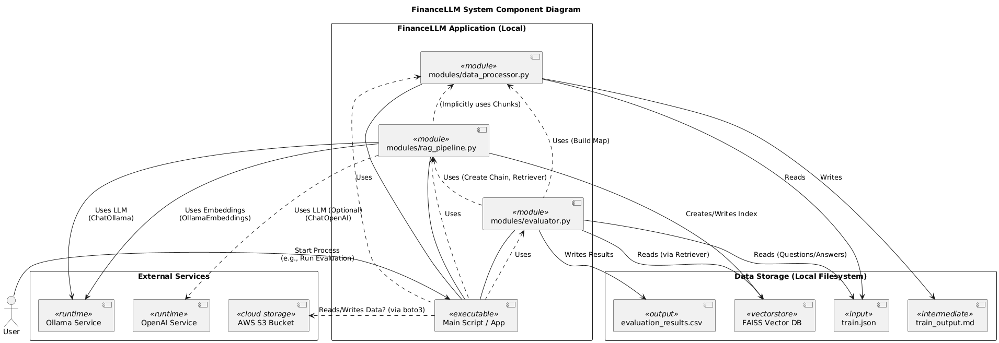

### FinanceLLM


FinanceLLM is a Retrieval-Augmented Generation (RAG) system for financial question-answering, enabling users to query financial metrics from structured data (e.g., `train.json`). It supports queries like percentage changes in net cash, net income, and total revenue, providing step-by-step reasoning and robust evaluation metrics. The project offers a Streamlit web interface (`app.py`) for interactive use and a Jupyter notebook (`notebook.ipynb`) for development and analysis.

Built with LangChain, FAISS, and Ollama (`deepseek-r1:1.5b`, `nomic-embed-text`), FinanceLLM processes JSON data into a vector store, retrieves relevant documents, and generates accurate answers. The evaluation system (`evaluator.py`) computes metrics such as correctness, precision, recall, hit rate, and NDCG, with results saved to `evaluation_results.csv` and `mean_retrieval_metrics.csv`. Docker support ensures easy deployment.


**Features**

* **Financial QA:** Answers financial queries with detailed reasoning using data from `train.json`.
* **Streamlit Interface:** Web app for uploading data, querying, and viewing evaluation metrics.
* **Jupyter Notebook:** Interactive environment for data processing, RAG pipeline testing, and evaluation.
* **Comprehensive Evaluation:** Metrics include correctness, precision, recall, hit rate, and NDCG, saved to CSV files.
* **Docker Support:** Containerized setup for consistent deployment.
* **Ollama Integration:** Local LLMs for cost-effective inference.
* **Vector Store:** FAISS-based document retrieval with persistent indices.


### Project Structure

Here is an overview of the project's directory layout:

```text
financellm/
├── app.py                      # Streamlit application for the web interface
├── data/
│   ├── train.json             # Input financial data in JSON format
│   └── train_output.md        # Generated Markdown from train.json
├── Dockerfile                 # Docker configuration for containerized deployment
├── architecture.png         # UML diagram of the project (not used in runtime)
├── modules/
│   ├── data_processor.py      # Converts JSON to Markdown and splits into chunks
│   ├── evaluator.py           # Computes evaluation metrics (correctness, precision, recall, hit rate, NDCG)
│   ├── __init__.py            # Module initialization
│   └── rag_pipeline.py        # Sets up RAG pipeline with FAISS and Ollama
├── notebook.ipynb             # Jupyter notebook for interactive development
├── README.md                  # Project documentation (this file)
├── requirements.txt           # Python dependencies
├── retrieval_metrics_summary.csv # Aggregated evaluation metrics (generated)          
└── vector_db/
    ├── train/
    │   ├── index.faiss        # FAISS index for vector store
    │   └── index.pkl          # FAISS metadata
    └── train.faiss/
        ├── index.faiss        # Additional FAISS index
        └── index.pkl          # Additional FAISS metadata

```

### System Architecture




### Demo Video


### Evaluation Metrics and Findings

The `evaluator.py` script evaluates the RAG system’s performance on questions derived from `train.json`, producing detailed per-question results (`evaluation_results.csv`) and aggregated retrieval metrics (`mean_retrieval_metrics.csv`). Below is a summary of findings based on the aggregated metrics, followed by an explanation of each parameter.

**Summary of Findings**

The evaluation metrics from `mean_retrieval_metrics.csv` (based on 50 questions) indicate strong retrieval performance at low $k$ values, with diminishing precision as more documents are retrieved, but consistent recall and hit rate improvements. Key observations:

* **High Precision at Low $k$:** At $k=1$, precision is $0.94$, indicating that the top retrieved document is highly relevant. Precision decreases to $0.073$ at $k=20$ as more documents are included, diluting relevance.
* **Stable Recall Growth:** Recall increases from $0.188$ at $k=1$ to $0.292$ at $k=20$, showing that relevant documents are retrieved as $k$ grows, capturing more of the relevant set (average of $5.35$ relevant documents per question).
* **Perfect Hit Rate at Higher $k$:** Hit rate reaches $1.0$ at $k=8$ and remains perfect, meaning at least one relevant document is retrieved for every question when fetching 8 or more documents.
* **Strong NDCG:** NDCG starts at $0.94$ for $k=1$ and stabilizes around $0.458$ at $k=20$, indicating good ranking quality, with relevant documents appearing early in the list.
* **Trade-offs:** High precision at low $k$ is ideal for focused retrieval, but the system retrieves all relevant documents only at higher $k$, balancing precision and recall.

#### Shortcomings:

* Precision drops significantly at higher $k$, suggesting noise in lower-ranked documents.
* Recall plateaus at $0.292$, indicating some relevant documents may be missed even at $k=20$.

**Future Improvements:**

* Enhance embeddings (e.g., switch to a finance-specific model) to improve document ranking.
* Implement re-ranking strategies to boost precision at higher $k$.
* Expand the dataset to increase the number of relevant documents per question.

**Metric Definitions**

* **$k$**: The number of top documents retrieved for evaluation. Metrics are computed for $k=1$ to $k=20$.
* **`mean_precision_at_k`**: Average proportion of retrieved documents (up to $k$) that are relevant. High precision ($0.94$ at $k=1$) indicates accurate top results, but it decreases as more documents are included.
* **`mean_recall_at_k`**: Average proportion of relevant documents retrieved out of all relevant documents for a question. Recall grows from $0.188$ to $0.292$, showing more relevant documents are captured at higher $k$.
* **`mean_hit_rate_at_k`**: Average proportion of questions where at least one relevant document is retrieved within the top $k$. A hit rate of $1.0$ at $k \ge 8$ means every question retrieves a relevant document.
* **`mean_ndcg_at_k`**: Normalized Discounted Cumulative Gain, measuring ranking quality (higher is better). NDCG of $0.94$ at $k=1$ indicates excellent top-1 ranking, with stable performance ($\approx 0.458$ at $k=20$).

### Prerequisites

* **Python:** Version 3.12.
* **Docker:** For containerized deployment (optional).
* **Ollama:** Local server for `deepseek-r1:1.5b` and `nomic-embed-text` models.
* **AWS Credentials:** For S3 access (optional, set in `.env`).
* **OpenAI API Key:** For optional GPT-4o-mini usage (set in `.env`).

### Setup

#### Local Installation

1.  **Clone the Repository:**
    ```bash
    git clone https://github.com/Danny024/financellm.git
    cd financellm
    ```
2.  **Create a Virtual Environment:**
    ```bash
    python3 -m venv venv
    source venv/bin/activate  # On Windows use `venv\Scripts\activate`
    ```
3.  **Install Dependencies:**
    ```bash
    pip install -r requirements.txt
    ```
4.  **Set Up `.env`:**
    Create a `.env` file in the root directory:
    ```env
    AWS_ACCESS_KEY_ID=your_access_key
    AWS_SECRET_ACCESS_KEY=your_secret_key
    OPENAI_API_KEY=your_openai_key
    ```
5.  **Start Ollama Server:**
    * Install Ollama: Follow instructions at [ollama.com](https://ollama.com).
    * Pull required models:
        ```bash
        ollama pull deepseek-r1:1.5b
        ollama pull nomic-embed-text
        ```
    * Start the server:
        ```bash
        ollama serve
        ```

#### Docker Installation

1.  **Build the Docker Image:**
    ```bash
    cd financellm
    docker build -t financellm .
    ```
2.  **Run the Container:**
    * **Streamlit:**
        ```bash
        docker run -p 8502:8502 -p 8888:8888 --env-file .env -v $(pwd)/data:/app/data -v $(pwd)/vector_db:/app/vector_db financellm streamlit
        ```
    * **Jupyter:**
        ```bash
        docker run -p 8502:8502 -p 8888:8888 --env-file .env -v $(pwd)/data:/app/data -v $(pwd)/vector_db:/app/vector_db financellm jupyter
        ```
3.  **Access:**
    * **Streamlit:** [http://localhost:8502](http://localhost:8502)
    * **Jupyter:** [http://localhost:8888](http://localhost:8888) (use token from `docker logs <container_id>`)

### Usage

#### Streamlit App

1.  **Run the App:**
    * **Local:** `streamlit run app.py`
    * **Docker:** See above.
2.  **Upload Data:**
    * Upload `data/train.json` via the UI.
    * Click "Process JSON" to convert and index the data.
3.  **Ask Questions:**
    * Example: “What was the percentage change in the net cash from operating activities from 2008 to 2009?”
    * Expected answer: 14.1%.
4.  **View Metrics:**
    * Click "View Metrics and Findings" to see correctness, precision, recall, hit rate, and NDCG.
    * Run "Batch Evaluation" to evaluate all questions and save results to `data/evaluation_results.csv`.

#### Jupyter Notebook

1.  **Run the Notebook:**
    * **Local:** `jupyter notebook notebook.ipynb`
    * **Docker:** Use Jupyter mode and access [http://localhost:8888](http://localhost:8888).
2.  **Execute Cells:**
    * Process `train.json`, set up the vector store, and run the RAG chain.
    * Evaluate questions in the final cell, saving results to `data/evaluation_results.csv` and `data/mean_retrieval_metrics.csv`.
3.  **Inspect Results:**
    * Check console output for metrics and CSV files for detailed results.

### Troubleshooting

* **Ollama Issues:**
    * Check server status: `curl http://localhost:11434`
    * Pull models manually:
        ```bash
        ollama pull deepseek-r1:1.5b
        ollama pull nomic-embed-text
        ```
* **Docker Port Conflicts:**
    * Use alternative ports: `docker run -p 8503:8502 -p 8889:8888 ...`
* **Data Issues:**
    * Ensure `data/train.json` contains entries like `Single_JKHY/2009/page_28.pdf-3`.


### License

This project is licensed under the MIT License. See `LICENSE` for details.

### Contact

For questions or issues, open a GitHub issue or contact the maintainer at [danieleneh024@gmail.com](mailto:danieleneh024@gmail.com).